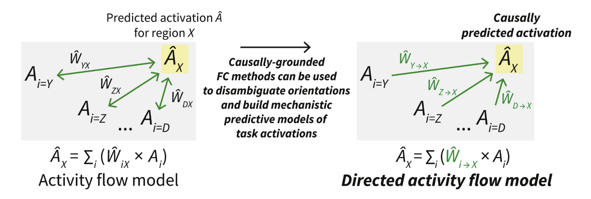
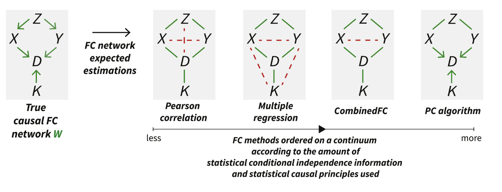
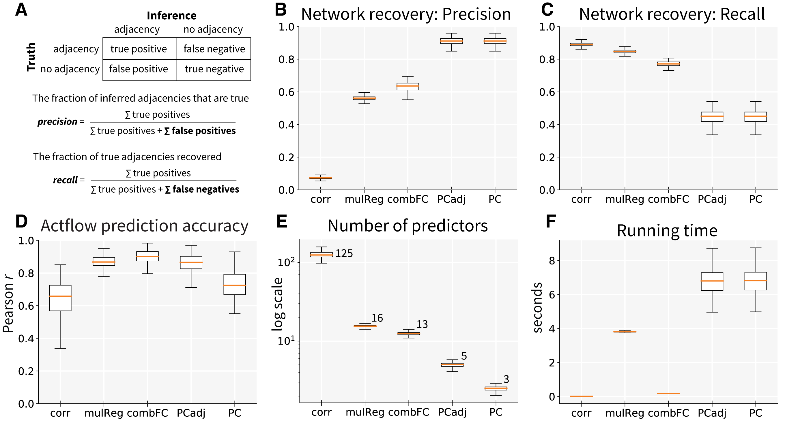
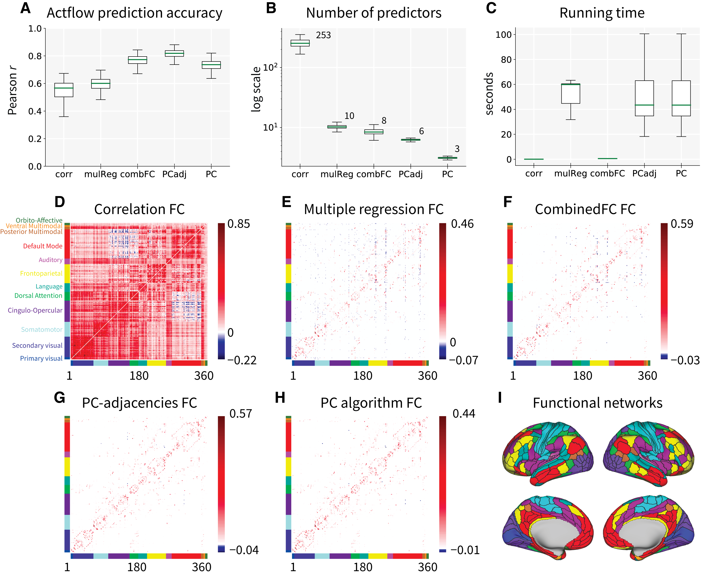

# Directed Activity Flow Modelling #

Repository for code and results from   
Sanchez-Romero, R., Ito, T., Mill, R. D., Hanson, S. J., & Cole, M. W. (2023). [Causally informed activity flow models provide mechanistic insight into network-generated cognitive activations](https://doi.org/10.1016/j.neuroimage.2023.120300). NeuroImage, 120300.

We present an approach to build generative directed [activity flow models](https://colelab.github.io/ActflowToolbox/) using fMRI functional connectivity (FC) inferred with the PC causal search algorithm, and task-related activations. 

We also compared commonly used FC methods ordered in a continuum in terms of the amount of statistical conditional independence information and causal principles they used.

## PC algorithm for directed functional connectivity ##
Importantly, we provide a Python based wrapper to run the version of the PC algorithm used in this paper, where we remove some orientation rules based on the assumption of no-cycles in the true connectivity. This accounts for the knowledge that brain networks contain cyclic patterns. In practice, we prefer to leave connections unoriented (that may or may not be a cycle) instead of incorrectly inferring the abscence of a cycle. Full description and pseudocode of the PC algorithm are in [Sanchez-Romero et al.](https://doi.org/10.1016/j.neuroimage.2023.120300).

## Pseudo-simulated data and results ##
We include a Python Jupyter notebook to reproduce pseudo-simulated data and results.

(Figure 2 from [Sanchez-Romero et al.](https://doi.org/10.1016/j.neuroimage.2023.120300)).

## Empirical data and results ##
We include a Python Jupyter notebook to reproduce fMRI empirical results using Human Connectome Project (HCP) data. 

(Figure 3. See [Sanchez-Romero et al.](https://doi.org/10.1016/j.neuroimage.2023.120300), for the rest of the results figures.)
