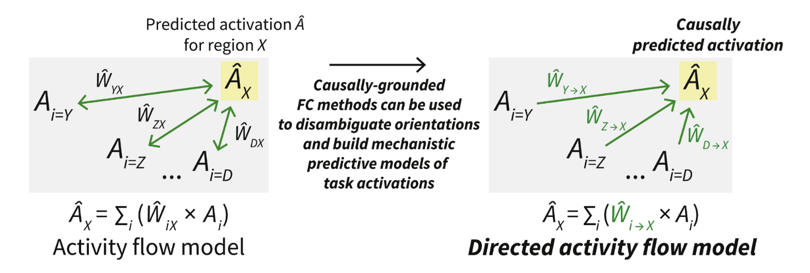
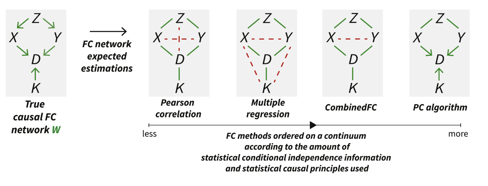
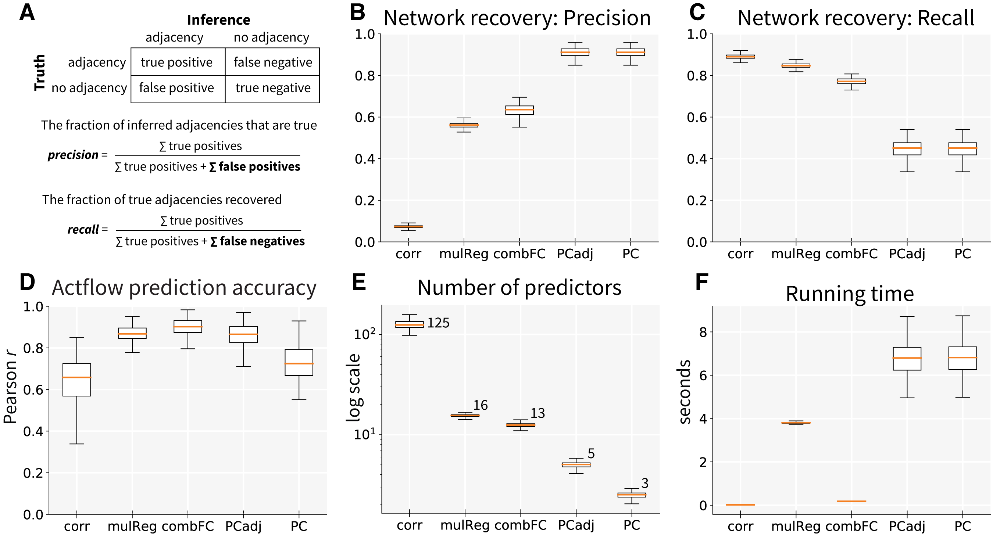
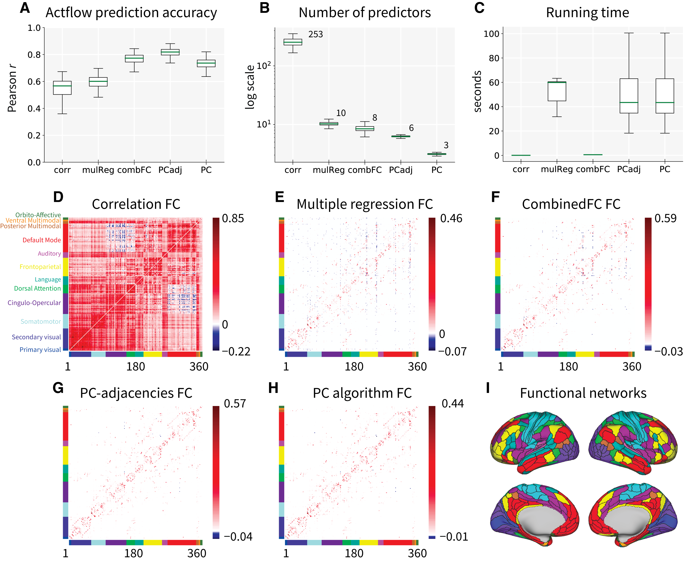

# Directed Activity Flow Modelling #

Repository for code and results from   
Sanchez-Romero, R., Ito, T., Mill, R. D., Hanson, S. J., & Cole, M. W. (2023). [Causally informed activity flow models provide mechanistic insight into network-generated cognitive activations](https://doi.org/10.1016/j.neuroimage.2023.120300). NeuroImage, 120300.

Use the repository [issues](https://github.com/ColeLab/DirectedActflow_release/issues) for questions or email ruben.saro.at.rutgers.edu. 

We present an approach to build generative directed [activity flow models](https://colelab.github.io/ActflowToolbox/) using fMRI functional connectivity (FC) inferred with the PC causal search algorithm, and task-related activations. 

<!------>

We also compared commonly used FC methods ordered in a continuum in terms of the amount of statistical conditional independence information and causal principles they used.

<!------>

## PC algorithm for directed functional connectivity ##
Importantly, we provide a Python wrapper to run the version of the PC algorithm used in this paper ([PCalgWrapper.py](https://github.com/ColeLab/DirectedActflow_release/blob/main/PCalgWrapper.py)), where we remove some orientation rules that assume no-cycles in the true connectivity. This accounts for the knowledge that brain networks contain cyclic patterns. In practice, we prefer to leave connections unoriented (that may or may not be a cycle) instead of incorrectly inferring the abscence of a cycle. Full description and pseudocode of the PC algorithm are in [Sanchez-Romero et al.](https://doi.org/10.1016/j.neuroimage.2023.120300).  
We highly recommend to check [PCalgorithm_run_example.ipynb](https://github.com/ColeLab/DirectedActflow_release/blob/main/PCalgorithm_run_example.ipynb) for an example run of the PC algorithm detailing aspects of the wrapper. See also the [Tetrad project website](https://sites.google.com/view/tetradcausal) for the original implementation of PC and other causal search algorithms.

## Pseudo-empirical simulations data and results ##
We include a Python Jupyter notebook to reproduce our pseudo-empirical simulations analysis and results: [simulations_results_release.ipynb](https://github.com/ColeLab/DirectedActflow_release/blob/main/simulations_results_release.ipynb). This simulation strategy was introduced in [Sanchez-Romero and Cole (2021)](https://doi.org/10.1162/jocn_a_01580) and accompanying repository [github.com/ColeLab/CombinedFC](https://github.com/ColeLab/CombinedFC).

<!------>

(Figure 2 from [Sanchez-Romero et al.](https://doi.org/10.1016/j.neuroimage.2023.120300)).

## Empirical data and results ##
We include a Python Jupyter notebook to reproduce fMRI empirical analysis and results using Human Connectome Project (HCP) data: [empirical_results_release.ipynb](https://github.com/ColeLab/DirectedActflow_release/blob/main/empirical_results_release.ipynb)

<!------>

(Figure 3. See [Sanchez-Romero et al.](https://doi.org/10.1016/j.neuroimage.2023.120300), for the rest of the results figures.)
